# Network RC Inside Out

开源网络遥控车项目

@EsonWong

<https://network-rc.esonwong.com/>

<!--
大家好，我是 Eson。感谢小红花为我一个分享的机会。今天我给大家分享我的用来做网络遥控车业余项目 Network RC。
 -->

---

## Eson Wong

9 年的 Web 前端开发，技术 Leader。
广州，天河

B 站： EsonWong
Twitter： @eson000

<!--
我先简单做个自我介绍，做了 9 年的 Web 前端开发。现在在广州一家智能硬件公司做技术 Leader。

-->

---

分享内容：

1. Network RC 介绍
2. 实机演示
3. 制作材料
4. 软件特性
5. 试玩 Network RC 网络遥控车

<!--
这次分享分为这 6 个部分：
1. 介绍这个项目是干什么的
2. 实机演示，现场演示
3. 硬件组成，目标是低成本的实现远程控制
4. 收看的观众大多数是软件技术相关的，分享一下我是用什么方式实现的低延迟视频
5. 我以前没有创过业。但我还是想聊一聊的我认知里，可以商业化的一些方法，希望能得到前辈们的一些指教。
6. 我家里有一台网络遥控车，我挑一两个发言比较踊跃位朋友试玩一下
-->

---

## 一、Network RC 介绍

Network RC 是运行在树莓派和浏览器上用于制作网络遥控车的软件。

  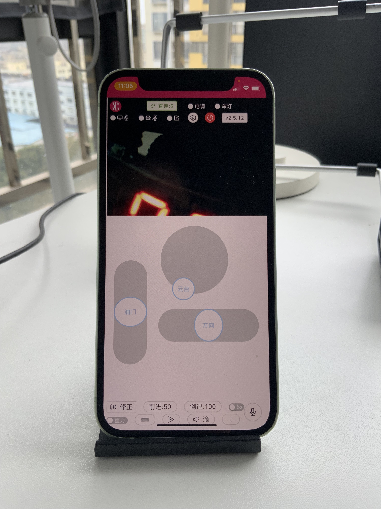 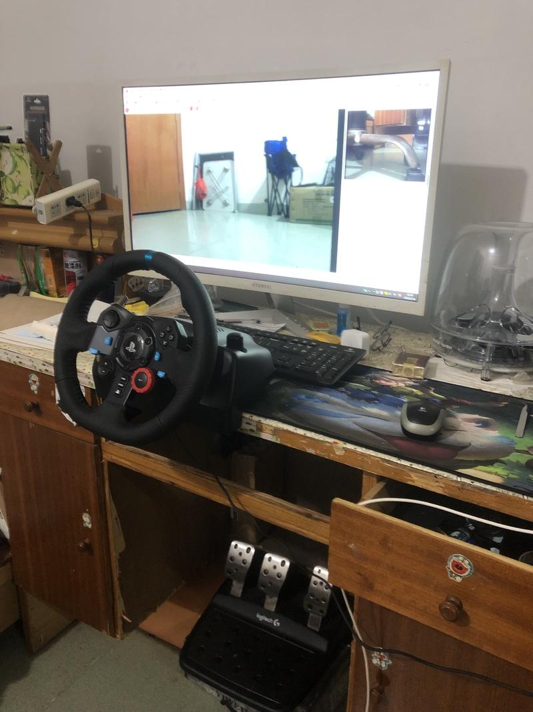

<!--
一句话介绍
1. 原型车
2. 我在广州玩上海的一位 Network RC 用户制作的网络遥控车
3. Network RC 的手机控制界面
4. 支持方向盘，另一位 Network RC 用户
 -->

---

### 特性

- 开源免费使用。
- 仅需树莓派和网络连接设备，一键安装的程序和简单的接线。
- 多摄像头、语音对讲和自定义通道应有尽有。
- 低延迟，毫秒级别的控制延迟，百毫秒级别的图传延迟。
- 软硬件兼容性好，通用 RC 遥控车支持，跨平台控制端支持。

---

## 二、演示

<!--
header: 二、演示
 -->

1. 控制界面

   [一号机](https://1.nrc.esonwong.com:9000)

2. 运行效果

   https://www.bilibili.com/video/BV1p5411f7en?zw

---

## 三、制作材料

<!--
header: 三、制作材料
 -->

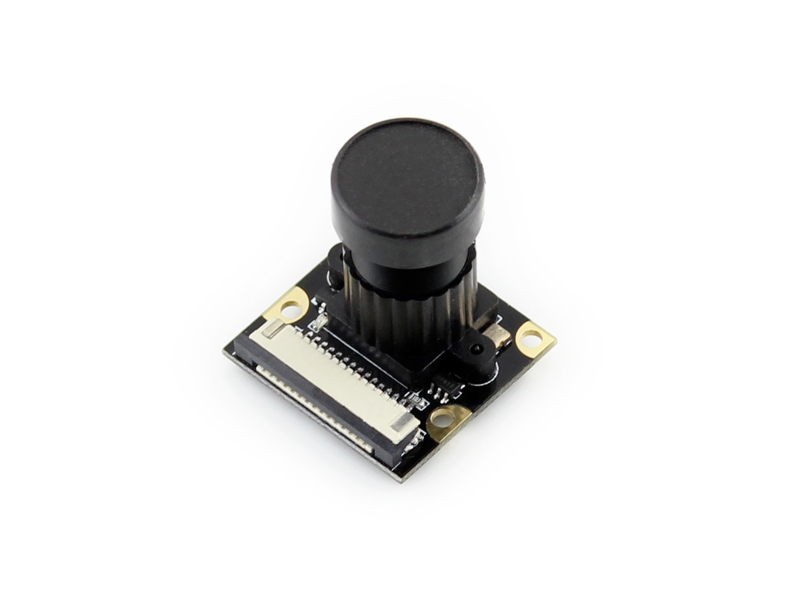
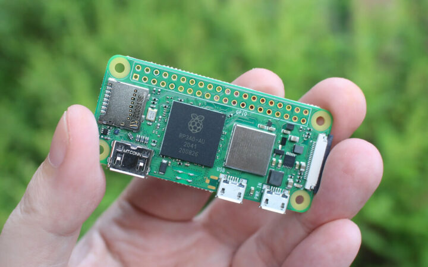
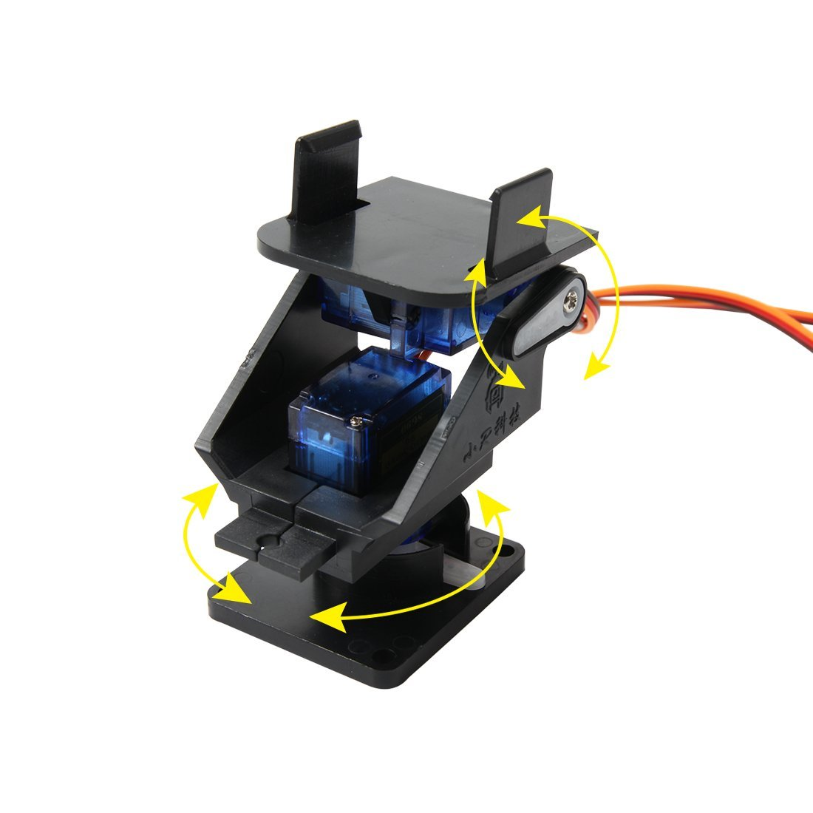

---

### 低成本的硬件

- 树莓派
- 遥控车
- 网络设备
- 其他可扩展设备
- 爱好者绘制的扩展版
- 用户为我制作的云台

<!--
主要的设备是：
1. 树莓派
2. 遥控车
3. 连网设备
 -->

---

### 树莓派

树莓派 4b
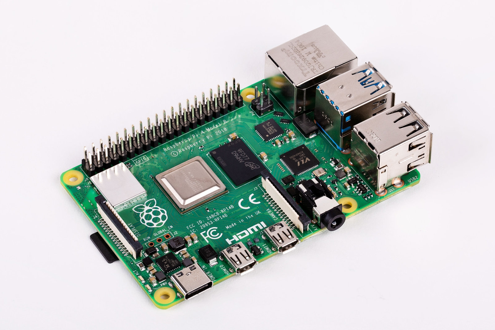

<!--
首先我们来讲树莓派。

遥控车的被控端运行在树莓派上。树莓派在维基百科上的描述是为学习计算机编程教育而设计，只有信用卡大小的微型电脑，其系统基于 Linux。

它很有很多 GOIO 接口可以用来控制遥控车硬件。
-->

---

树莓派 zero 2

<!-- 还有一个更小的版本， 树莓派 zero 。Network RC 只能运行在最近推出的 zero 2 上。 zero 1 的 ARM 芯片的版本太老了。 -->

---

#### 遥控车

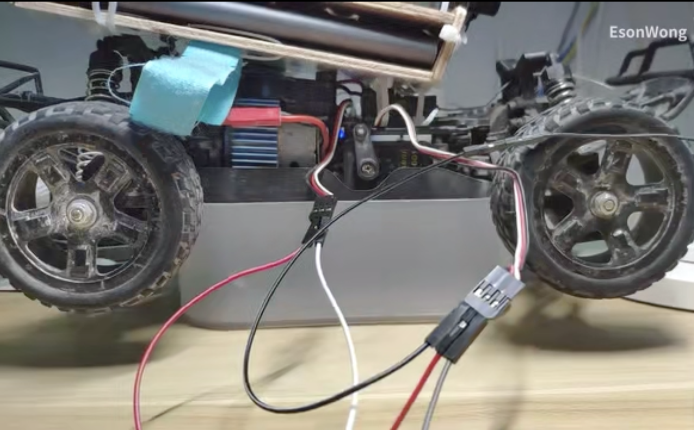

- 电调
- 舵机

<!--

摘下来是遥控车，需要带电调和转向舵机的。有的玩具遥控车需要再买一个电调来控制，没有转向舵机的玩具遥控车就很验证改了。
 -->

---

默认设置的全部硬件接线图。

支持 27 路 PWM 或高低电平控制。

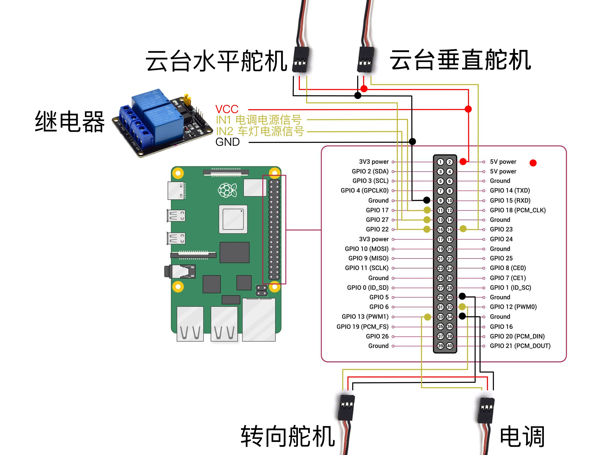

---

## 网络设备

可以用

- 手机热点
- 4/5G 移动路由器
- 工业级网络设备

<!--
待会演示是连的我自家的移动路由器。
-->

---

## Network RC 用户制作和分享的配件

控制版

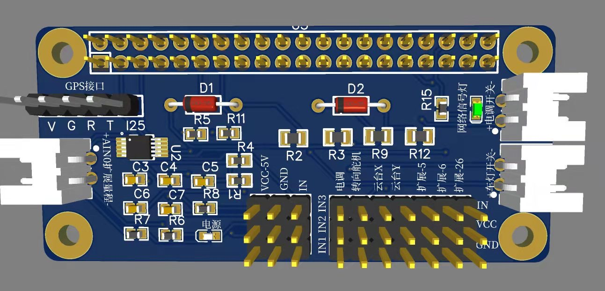
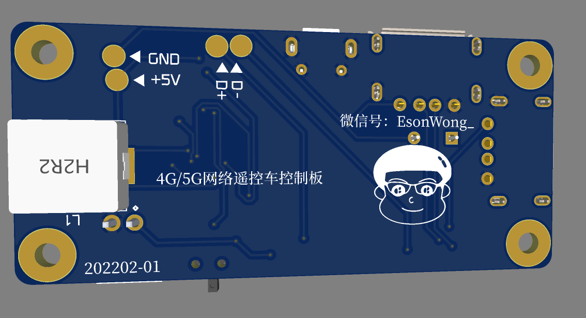

<!--
它们不是必需的。

现在看到的是控制板，让制作 Network RC 遥控车更简单。它和安装在树莓派上之后遥控车的电调和舵机的插头可以直接插上去，不再需要复杂的接线。

还可以及来测量电池的电压等等，让你随时知道电池的电量。

还有 GPS 硬件的接口
 -->

---

电源版

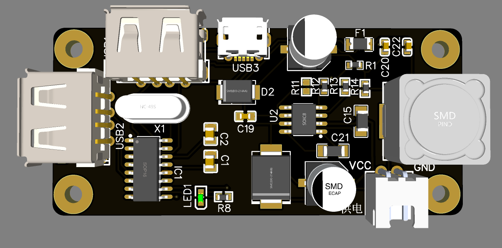
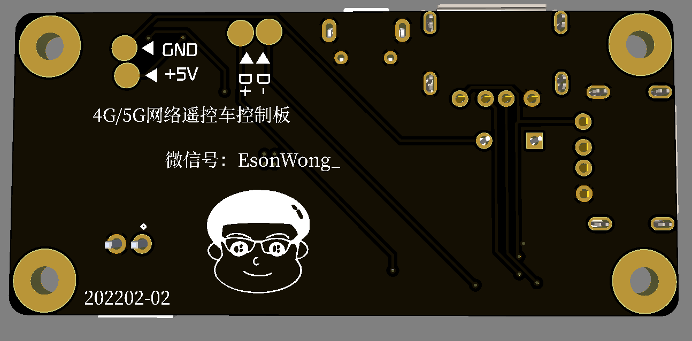

<!--
这一块是电源板，用于给树莓派供电，接锂电池转换电压。
扩展 USB 接口，可以接入 USB 摄像头、音频设备等。
-->

---

云台

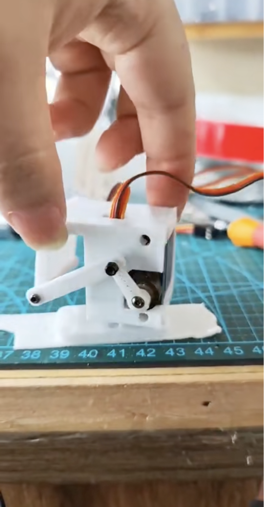

<!--
让制作 Network RC 遥控车更简单。RC 遥控车买回来拆开，拨下电调和转向舵机，接上电池
还能提供电压检测，让你随时知道电池的电量。
过有 GPS 硬件的接口
-->

---

## 四、软件特性

低延迟视频

<!--
远程遥控车对视频的延迟要求很高，我在设计整个方案的的时候，就把视频的延迟的优先级定的很高。

这是在 4G 网络下的延迟表现。
-->

<!--
header: 四、软件特性：低延迟视频
-->

---

### 进化

1. Websocket 逐帧视频传输
2. WebRTC 视频通话方案
3. WebRTC Data Channel 逐帧视频传输

<!--
下面为大家分享我是如何设计和一步步改进视频图传的方案的。
-->

---

### Websocket 逐帧视频编码和传输

1. 树莓派 h264 硬编码
2. ffmpeg 逐帧编码
3. 浏览器 Canvas 无缓冲逐帧解码与播放

<!--

Broadway 浏览器 h264 解码和播放

问题： 树莓派上的 websocket 服务器逐帧广播经过 h264 编码的画面，
依赖中转服务器
服务器的距离和带宽非常影响视频的延迟和稳定性。
-->

---

### WebRTC 视频通话方案

WebRTC，名称源自网页即时通信（英语：Web Real-Time Communication）的缩写，是一个支持网页浏览器进行实时语音对话或视频对话的 API。它于 2011 年 6 月 1 日开源并在 Google、Mozilla、Opera 支持下被纳入万维网联盟的 W3C 推荐标准。

<!--
措施：WebRTC WebRTC，是一种非常高效的方案。
-->

<!--
效果： 不依赖中转服务器，可以直接连接到车子双向传输音视频。
-->

<!--
问题：
1. 画面延迟反而更大。WebRTC 视频编码和解码是为语音通话设计的，更多的考虑画面延迟和质量的平衡
   - 编码延迟
   - 缓冲延迟

3. 不能 100% 建立点对点的连接
-->

---

### WebRTC Data Channel 逐帧视频传输方案

1. 最大程度兼容网络环境
2. 优先使用低延迟网络方式
3. 低延迟的视频编解码
4. 无缓冲逐帧解码与播放

<!--
措施：
1. 保留 websocket 方案
2. 改进 WebRTC 的方案
   1. 使用 H264 硬编码
   2. 使用数据通道传输
3. 两种方案无缝切换，优先 WebRTC
-->

<!--
效果：
1. 最大程度兼容网络环境
2. 优先使用低延迟网络方式
3. 低延迟的视频编解码
4. 无缓冲逐帧解码与播放
-->

---

### 依赖

#### 车端软件

- Nodejs
- express.js
- wrtc：Nodejs 的 WebRTC 库
- ffmpeg
- frpc

#### 浏览器

- React
- WebRTC
- Broadway.js : A JavaScript H.264 decoder

---

<!-- ## 五、一点点的商业化思考 -->

<!--
header:  五、一点点的商业化思考
-->

<!-- ## 其它方案

1. 欢乐的小肥羊
2. 酷玩
3. OpenHD

## 我的可以选择的模式

1. 成品遥控车
2. 分享平台
3. 网络直播游戏

--- -->

## 五、 试玩

1. 在浏览器中打开分享链接
2. 控制
   1. 手机：先打开 UI 编辑开关把 UI 调整到方便的位置和大小
   2. 电脑：用键盘 wsad 控制移动， ikjl 控制摄像头云台

<!--
现在我来挑一两位观众来试玩一下。我把分享链接发给试玩者。
玩的方法
 -->

---

## 感谢

<!--
header:  感谢
-->

感谢赖前辈提供的本次分享的机会。

---

## Network RC 交流

Github: <https://github.com/itiwll/network-rc>
主页: <https://network-rc.esonwong.com/>

 

<!--
1、树莓派或类似的产品，是否降低了“嵌入式”编程的门槛？可否简单例举3点？

首先树莓派并不是一个嵌入式的系统，对于从事互联网的开法者们来说，它降低了接入硬件的门槛。

2、日常工作和爱好之间如何平衡，自由职业与财务自由是否追求兴趣爱好的必要条件？

这个项目是基于我个人兴趣而诞生的，其实它的开发跨度很长，到现在快两年了。它基本不影响的的工作和娱乐生活。财务自由也还是我在追求的目标。现在我已经不是自由职业了。所以对我来这两个都不是我追求兴趣的前提，我觉得它们是可以同时去追寻的。

3、作为技术Leader，面试时会考察候选人的编程技能吗？有没有遇到过候选人的反问挑战？

会从多个方面去考察，一定会去考察技术问题。通常是笔试和面聊，但我都不太喜欢用这两种形式去考查。因为脱离了实际的一个工作环境，量化起来也很繁琐，不客观。

-->
